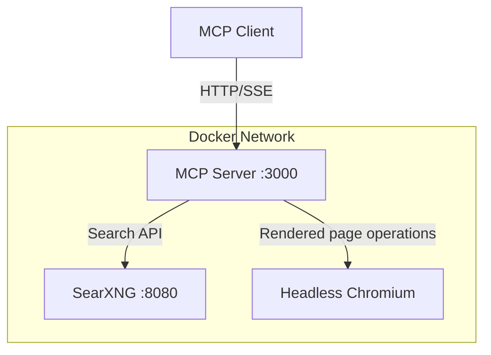

# MCP Web Search Server

Dockerized MCP server that combines:

- SearXNG for meta-search snippets
- Playwright Chromium for rendered page reading and screenshots
- FastMCP tools exposed on port 3000

## Architecture



## Services and Ports

| Service | Host Port | Purpose |
|:--|:--|:--|
| SearXNG | 127.0.0.1:8081 | Local search backend UI/API |
| MCP | 127.0.0.1:3000 | MCP tools endpoint |

MCP endpoint options (depends on client support):

- Streamable HTTP: http://localhost:3000/mcp
- SSE: http://localhost:3000/sse

## Requirements

- Docker Desktop (or compatible Docker daemon)
- Docker Compose support (`docker compose` or `docker-compose`)
- Python 3.x (for deployment helper script)
- MCP-compatible client (LM Studio, Claude Desktop, Cursor, Continue, etc.)

## Quick Start

1. Create .env with a random SearXNG secret:

```bash
echo "SEARXNG_SECRET=$(openssl rand -hex 32)" > .env
```

2. Start services:

```bash
python3 deploy-local.py --start
```

3. Connect your MCP client:

- Prefer: http://localhost:3000/mcp
- Fallback: http://localhost:3000/sse

If your client keeps a long-lived session, reconnect after container restart to avoid stale-session errors.

## MCP Tools

The server currently exposes these tools:

| Tool | Description |
|:--|:--|
| search | Fast snippet search from SearXNG |
| deep_search | Search plus rendered full-page extraction |
| navigate | Open a URL and return text or HTML |
| screenshot | Capture a page screenshot (PNG) |
| read_page | Unified page reader: links, text, headlines, or full |

### search and deep_search parameters

| Parameter | Default | Notes |
|:--|:--|:--|
| query | required | Search query |
| categories | general | Example: general, news, science, it |
| language | auto | Language code or auto |
| safe_search | 0 | 0 off, 1 moderate, 2 strict |
| time_range | "" | "", day, week, month, year |
| max_results | 10 or 3 | search: 1-20, deep_search: 1-10 |

## Deployment Commands

```bash
python3 deploy-local.py --start
python3 deploy-local.py --rebuild
python3 deploy-local.py --stop
python3 deploy-local.py --logs
python3 deploy-local.py --start --logs
```

Notes:

- `--rebuild` implies `--start`.
- `mcp/server.py` and `mcp/web_core.py` are bind-mounted into container, so code edits can be applied with `docker restart mcp` (no image rebuild required).

## Environment Variables

Configured in docker-compose:

| Variable | Default | Purpose |
|:--|:--|:--|
| MCP_TRANSPORT | streamable-http | MCP transport mode |
| MCP_HOST | 0.0.0.0 | Bind host |
| MCP_PORT | 3000 | Bind port |
| SEARXNG_URL | http://searxng:8080 | Internal SearXNG URL |
| SEARXNG_TIMEOUT | 25 | Search request timeout (seconds) |
| PAGE_TIMEOUT | 15000 | Browser navigation timeout (ms) |
| FETCH_CONCURRENCY | 5 | Parallel fetches in deep_search |

Supported in code (optional to set):

| Variable | Default | Purpose |
|:--|:--|:--|
| PAGE_POOL_SIZE | 4 | Pre-warmed Playwright pages |
| CONTEXT_ROTATION_THRESHOLD | 100 | Rotate browser context every N navigations |
| ALLOW_PRIVATE_NETWORK | false | Allow private-network URLs |

Important container settings:

- `shm_size: 512m` is set for Chromium stability.

## LM Studio Example

Included config file:

- `mcp-lmstudio-config.json`

Current sample uses SSE URL:

```json
{
    "mcpServers": {
        "web-search": {
            "url": "http://localhost:3000/sse"
        }
    }
}
```

If your client supports streamable HTTP MCP directly, use `http://localhost:3000/mcp`.

## Project Structure

```text
.
├── deploy-local.py
├── docker-compose.yml
├── mcp-lmstudio-config.json
├── README.md
├── mcp/
│   ├── Dockerfile
│   ├── requirements.txt
│   ├── server.py
│   └── web_core.py
└── searxng/
        └── settings.yml
```

## Troubleshooting

1. Docker daemon unavailable

- Start Docker Desktop (or your active daemon) and retry.

2. .env missing or empty secret

- Ensure `.env` exists and includes `SEARXNG_SECRET=...`.

3. MCP health check fails

- Check logs:

```bash
docker logs mcp
docker logs searxng
```

4. Playwright or browser instability

- Keep `shm_size: 512m` in docker-compose.
