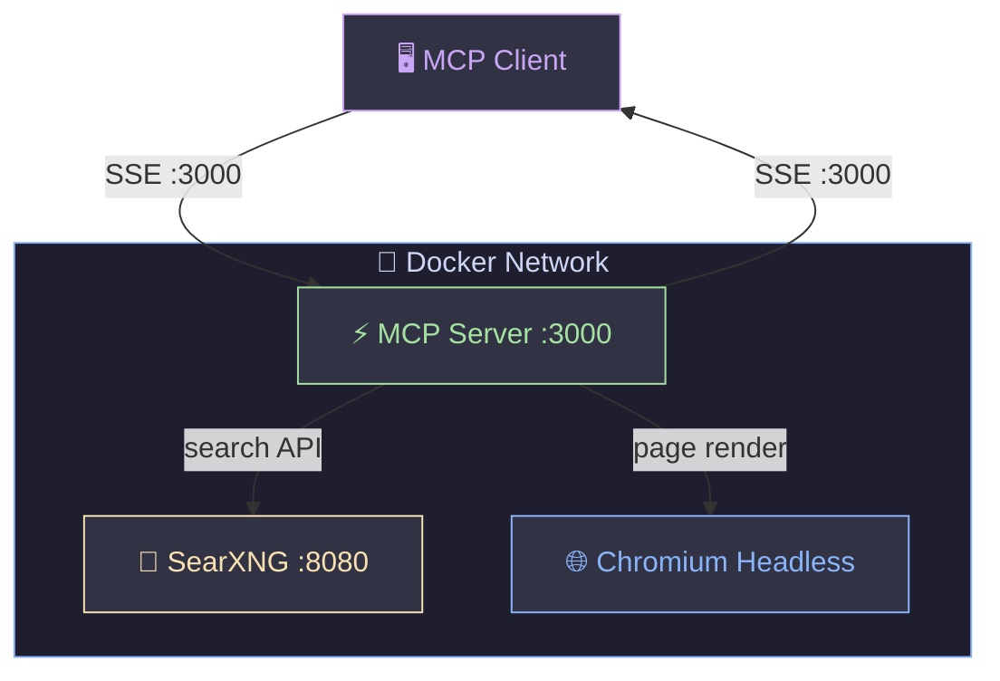

<div align="center">

# 🔍 MCP Web Search Server

**🐳 Docker-based MCP server — web search + headless browser**

[](https://www.docker.com/)
[](https://modelcontextprotocol.io/)
[](https://www.python.org/)
[](https://playwright.dev/)
[](https://httpwg.org/specs/rfc7540.html)

</div>

---

## 🏗️ Architecture



| Service | Port | Description |
|:--------|:----:|:------------|
| 🔎 SearXNG | `127.0.0.1:8081` | Private meta-search engine (localhost only) |
| ⚡ MCP | `127.0.0.1:3000` | Search + browser tools via SSE |

> 💡 MCP connects to SearXNG via Docker internal network — external port is for debugging only.

---

## 📋 Requirements

| Requirement | Note |
|:------------|:-----|
| 🐳 [Docker](https://docs.docker.com/get-docker/) & Docker Compose | Container runtime |
| 🐍 Python 3.x | For `deploy-local.py` helper script |
| 🤖 MCP-compatible client | Claude Desktop, Cursor, Continue, LM Studio, etc. |

---

## 🚀 Quick Start

```bash
# 1️⃣ Create environment file
echo "SEARXNG_SECRET=$(openssl rand -hex 32)" > .env

# 2️⃣ Build & launch
python3 deploy-local.py --start

# 3️⃣ Connect your MCP client to:
#    👉 http://localhost:3000/sse
```

> [!WARNING]
> ⚠️ After restarting the MCP container, reconnect your client to avoid `-32602` session errors.

---

## 🛠️ Tools

| Tool | Speed | Description |
|:-----|:-----:|:------------|
| 🔍 `search` | ⚡ ~1s | **Default.** SearXNG snippets, sorted by relevance score |
| 📖 `deep_search` | 🕐 ~2-3s | Search + full page content via headless browser |
| 🧭 `navigate` | 🕐 ~1-2s | Fetch a URL as visible text or raw HTML |
| 📸 `screenshot` | 🕐 ~2s | Capture a page as PNG image |
| 🔗 `extract_links` | ⚡ ~1s | All hyperlinks from a page |
| ✂️ `extract_text` | ⚡ ~1s | Text from a specific CSS selector |
| 📰 `headlines` | ⚡ ~1s | All h1–h6 headings from a page |

<details>
<summary>📝 Parameters — <code>search</code> / <code>deep_search</code></summary>

| Parameter | Default | Values |
|:----------|:-------:|:-------|
| `query` | — | 🔤 Search string |
| `categories` | `general` | `general` · `news` · `science` · `it` · `images` · `videos` |
| `language` | `auto` | `en` · `zh` · `ja` · `ko` ... or `auto` (detected from query) |
| `safe_search` | `0` | `0` off · `1` moderate · `2` strict |
| `time_range` | `""` | `""` any · `day` · `week` · `month` · `year` |
| `max_results` | `10` / `3` | 1–20 for search · 1–10 for deep_search |

</details>

---

## 💻 Commands

```bash
python3 deploy-local.py --start        # 🟢 Start (skips rebuild if image exists)
python3 deploy-local.py --rebuild      # 🔄 Force rebuild, then start
python3 deploy-local.py --stop         # 🔴 Stop and remove containers
python3 deploy-local.py --logs         # 📋 Stream logs
python3 deploy-local.py --start --logs # 🟢 Start + stream logs
```

> 💡 `server.py` and `web_core.py` are volume-mounted — `docker restart mcp` applies code changes without rebuilding.

---

## ⚙️ Environment Variables

| Variable | Default | Description |
|:---------|:-------:|:------------|
| `SEARXNG_URL` | `http://searxng:8080` | 🔎 Internal SearXNG endpoint |
| `SEARXNG_TIMEOUT` | `25` | ⏱️ httpx timeout (s) — must exceed SearXNG `max_request_timeout` |
| `PAGE_TIMEOUT` | `15000` | ⏱️ Playwright navigation timeout (ms) |
| `FETCH_CONCURRENCY` | `5` | 🔀 Parallel page fetches in `deep_search` |
| `PAGE_POOL_SIZE` | `4` | 🏊 Pre-allocated browser pages for reuse |
| `CONTEXT_ROTATION_THRESHOLD` | `100` | ♻️ Rotate browser context every N navigations |

> ⚠️ `shm_size: 512m` is required for Chromium — the Docker default (64 MB) causes crashes.

---

## 🚄 Performance Features

| Feature | Benefit |
|:--------|:--------|
| 🏊 **Page Pool** | Pre-allocated pages avoid 50-100ms creation overhead per request |
| 💾 **TTL Cache** | Repeated queries return instantly (45s cache, 64 entries) |
| 🌐 **HTTP/2** | Multiplexed connections to SearXNG |
| 📸 **Smart Screenshot** | `networkidle` detection replaces fixed 1s delay |
| ♻️ **Context Rotation** | Auto-cleanup prevents memory growth |
| 🔀 **Dual Contexts** | Separate browser contexts for text extraction vs screenshots |

---

## ☁️ Deploy to AKS (Azure Kubernetes Service)

Use `deploy-aks.sh` to deploy the full stack to an **existing** AKS cluster from WSL or Linux:

```bash
# Deploy to your existing AKS cluster
./deploy-aks.sh --subscription <sub-id> --resource-group <rg> --cluster-name <aks-name>

# With custom ACR name (default: acrmcpwebsearch)
./deploy-aks.sh --subscription <sub-id> --resource-group <rg> --cluster-name <aks-name> --acr-name myacr123
```

**Required flags:**

| Flag | Description |
|:-----|:------------|
| `--subscription` | Azure Subscription ID (prompted if omitted) |
| `--resource-group` | Resource Group containing your AKS cluster |
| `--cluster-name` | Name of your existing AKS cluster |

**Optional flags:**

| Flag | Default | Description |
|:-----|:-------:|:------------|
| `--acr-name` | `acrmcpwebsearch` | Azure Container Registry name (created if missing) |
| `--namespace` | `mcp-websearch` | Kubernetes namespace |
| `--secret` | *(auto-generated)* | SearXNG secret key |

**Prerequisites** (auto-installed if missing during preflight):

| Tool | Install (WSL/Linux) |
|:-----|:--------------------|
| `az` | `curl -sL https://aka.ms/InstallAzureCLIDeb \| sudo bash` |
| `kubectl` | `sudo az aks install-cli` |
| `docker` | `sudo apt-get install -y docker.io` |

**What it does:**

1. Validates that `--resource-group` and `--cluster-name` are provided
2. Creates ACR if it doesn't exist, attaches it to the AKS cluster
3. Builds MCP image and pushes to ACR
4. Deploys SearXNG (ClusterIP) + MCP (LoadBalancer) with health probes
5. Outputs the external MCP SSE endpoint URL

> 💡 MCP service gets a public LoadBalancer IP. SearXNG stays internal (ClusterIP only).

---

## 📁 Project Structure

```
📦 MCPserver/
├── 🚀 deploy-local.py              # Local Docker deployment helper
├── ☁️ deploy-aks.sh              # AKS deployment (bash/WSL)
├── 🐳 docker-compose.yml         # Container orchestration
├── 🤖 mcp-lmstudio-config.json   # LM Studio MCP client config
├── 🔒 .env                       # SEARXNG_SECRET (create manually)
├── 📂 mcp/
│   ├── ⚡ server.py              # MCP tool definitions (FastMCP)
│   ├── 🧠 web_core.py            # Core engine (pool, cache, HTTP/2)
│   ├── 🐳 Dockerfile
│   └── 📋 requirements.txt
└── 📂 searxng/
    └── ⚙️ settings.yml           # Search engines & tuning
```

---

<div align="center">

**Built with ❤️ for fast, private web search via MCP**

</div>
